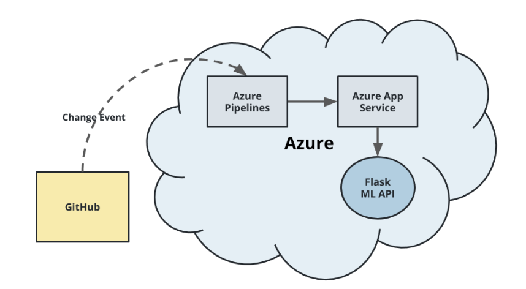
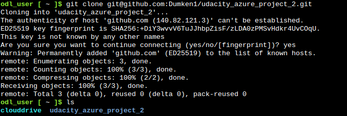
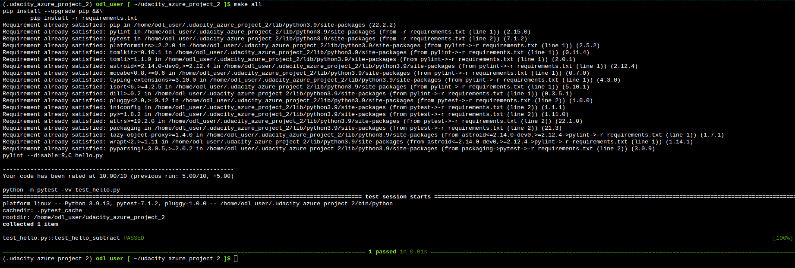
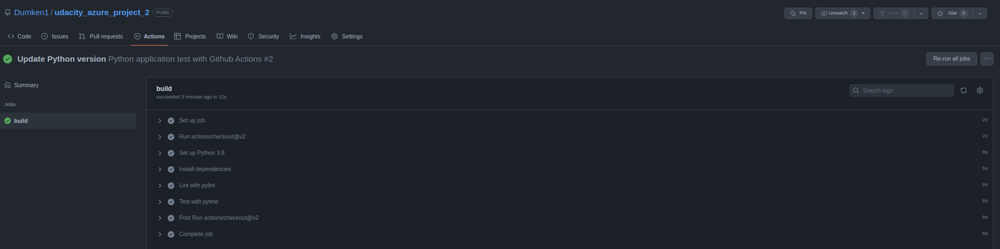
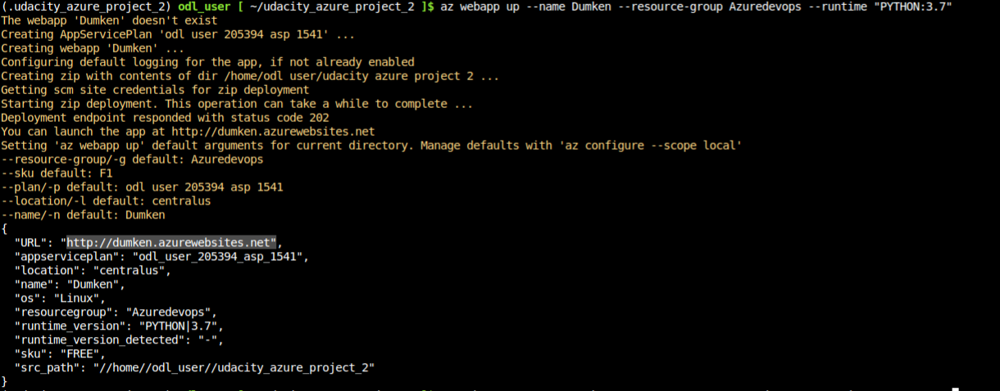
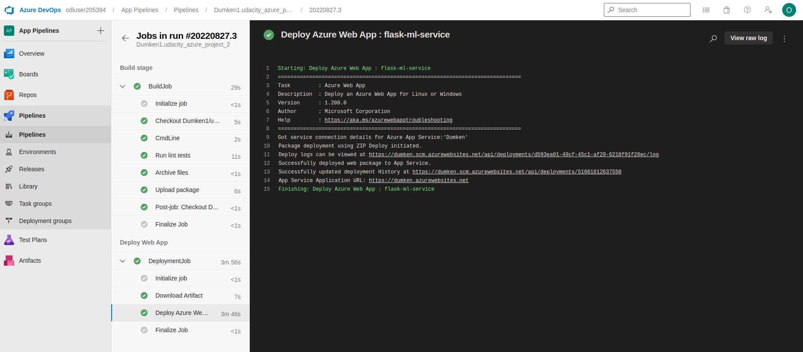
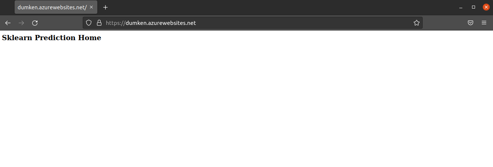
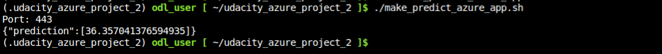
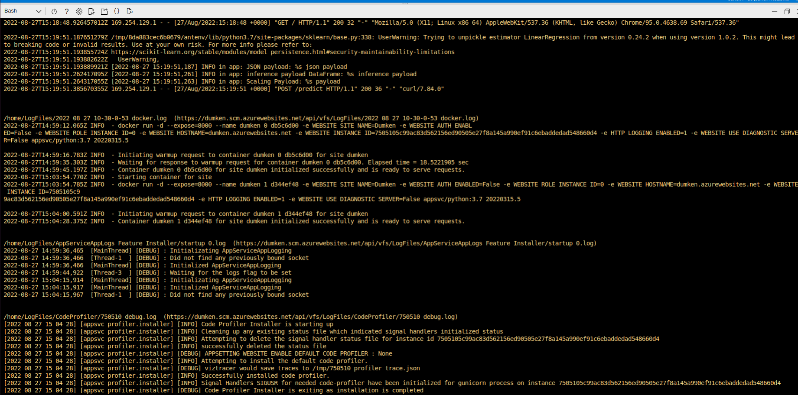
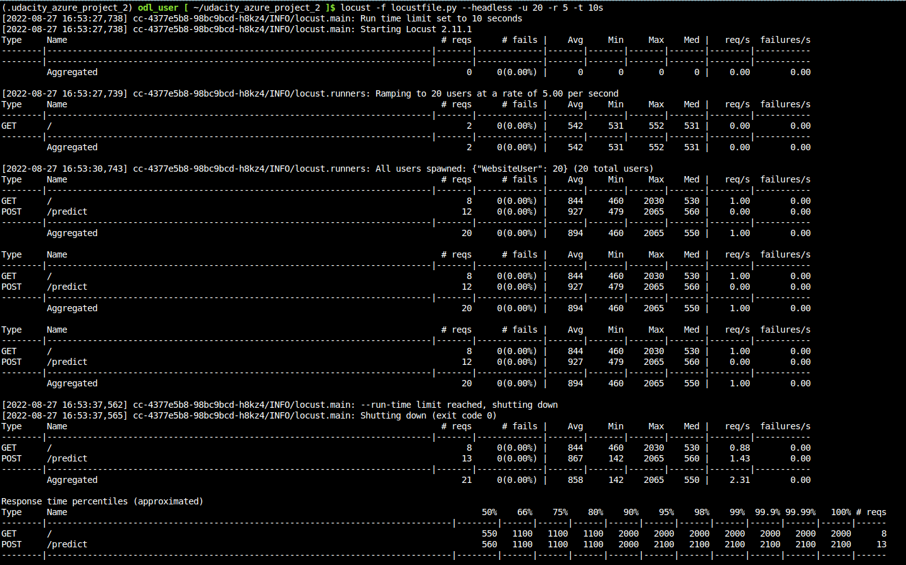

# Udacity Azure Project 2

[](https://github.com/Dumken1/udacity_azure_project_2/actions/workflows/python-app.yml)

## Overview

This is the second udacity project to demonstrate the continious integration and continious delivery process using Github and Azure of for Integration and deployment respectively.

The project implementation steps include:

- Project Planning
- CI: Set Up Azure Cloud Shell
- CI: Configure Github Actions
- Continious Delievery on Azure

### Requirements
- [Azure Account](https://portal.azure.com/cobrand/?id=12&mkt=DA-DK&cbcxt=azubill)
- [Github Account](https://github.com/)
- [Azure Devops Account](https://dev.azure.com/)

## Project Plan
* [Trello Board](https://trello.com/invite/b/h5iPxchn/416219f027278f76e91d2d43cb2c841c/udacity-azure-project-2)
* [Spreadsheet](https://docs.google.com/spreadsheets/d/1pUB1HSulLt6hyPuISda7ChoGZRG02p2UohwmdOAX8OI/edit?usp=sharing)

## Instructions
The workflow shown below shows the flask ML application deployment workflow architecture.



## Task 1: CI: Set Up Azure Cloud Shell

- Ensure you have an SSH key generated for your system. If not you can generate one using the command ``` ssh-keygen -t rsa ```
 and then copy it to your github page as explained in this [page](https://docs.github.com/en/authentication/connecting-to-github-with-ssh/adding-a-new-ssh-key-to-your-github-account)
- Clone the github repository for this project using the following command
```
git clone git@github.com:Dumken1/udacity_azure_project_2.git
```
 

- Enter the folder using ``` cd udacity_azure_project_2 ``` and then run the following command to create a virtual environment.

```
python3 -m venv ~/.udacity_azure_project_2
source ~/.udacity_azure_project_2/bin/activate
```
After this run the make all command to download and install the dependency files then also lint and test the *hello.py* code.

Your output should be similar to the image shown below.



## Task 2: Github Actions
The github actions is already setup and can be triggered by any modification of the repo both on the github and by CLI "commit" and "push" command.

A successful integration should have similar output on the github actions view page as shown in the image below.




## Task 3: Continious Deployment on Azure
* create web app by executing command 
```bash
az webapp up --name dumken --resource-group Azuredevops --runtime "PYTHON:3.7"
```
 You should have a similar output as shown below 
 
 

* Login into your Azure portal and Azure Devops account then follow the process shown in this [Document](https://docs.microsoft.com/en-us/azure/devops/pipelines/ecosystems/python-webapp?view=azure-devops) to setup your deployment processes and setting up a service connection.

* After setup, the azure devops pipeline will show the build and deployment stages of your webapp. A successful build and deplomwnt result should be similar as shown below.



* To check whether your WebApp works fine, go to the following link https://dumken.azurewebsites.net. You should have a similar view as shown below



Run the make_predict_azure_app.sh bash file to make predictions. ou should have a similar output shown below. 



* Output of streamed log files from deployed application



### Locust Output


## Enhancements

- Automate processes using IAS
- Write a test for the app.py

## Demo 

[Video of Demo](https://1drv.ms/v/s!ApB78pLGeml3gaNgyrnZSK-Yyyls2g)


